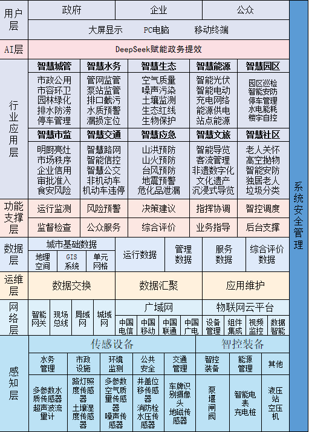
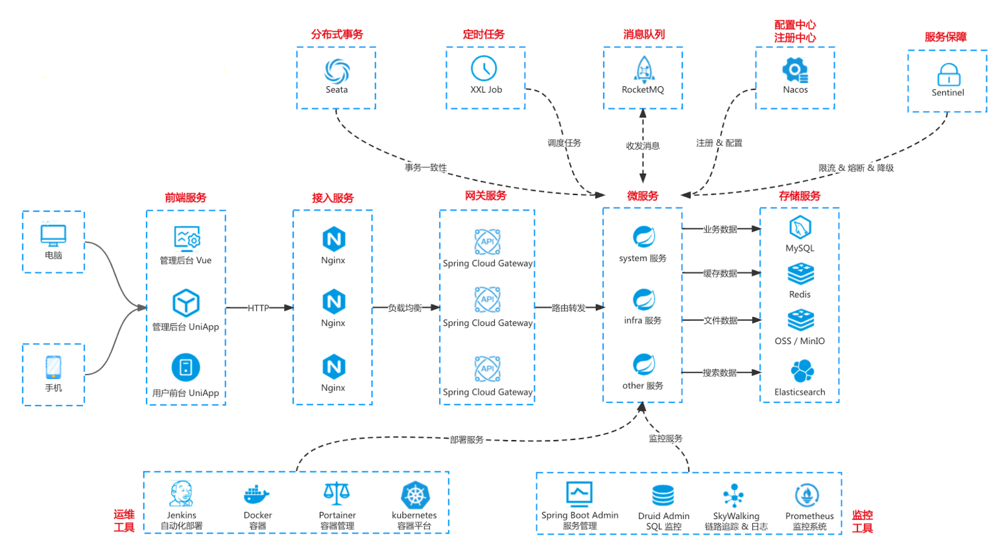
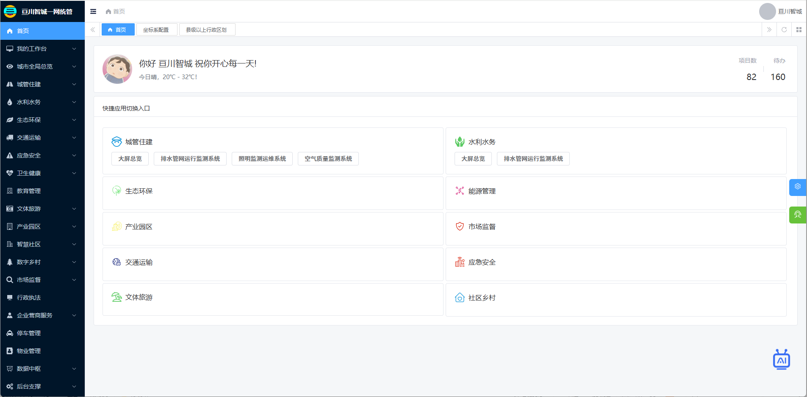
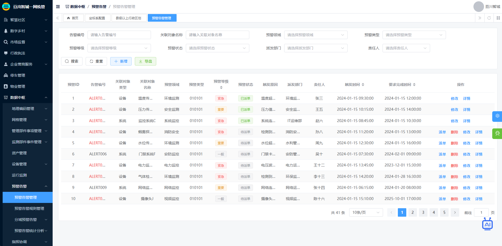
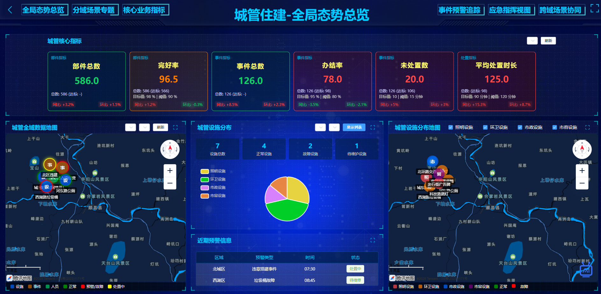
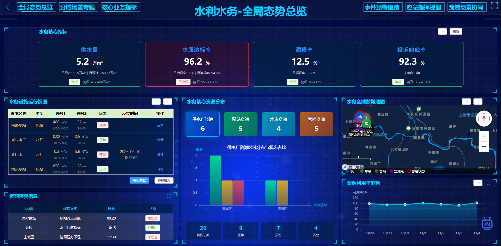
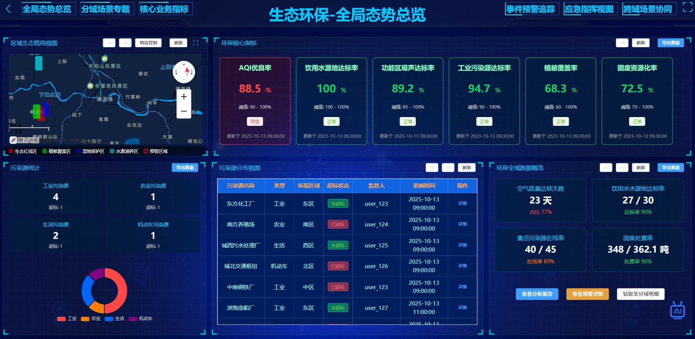
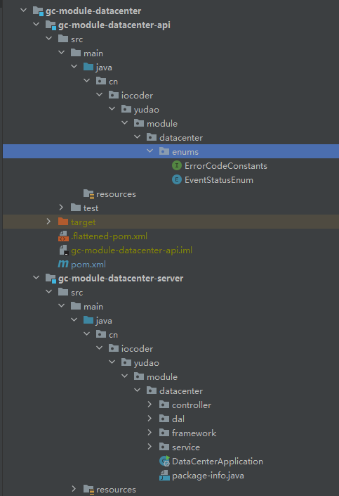
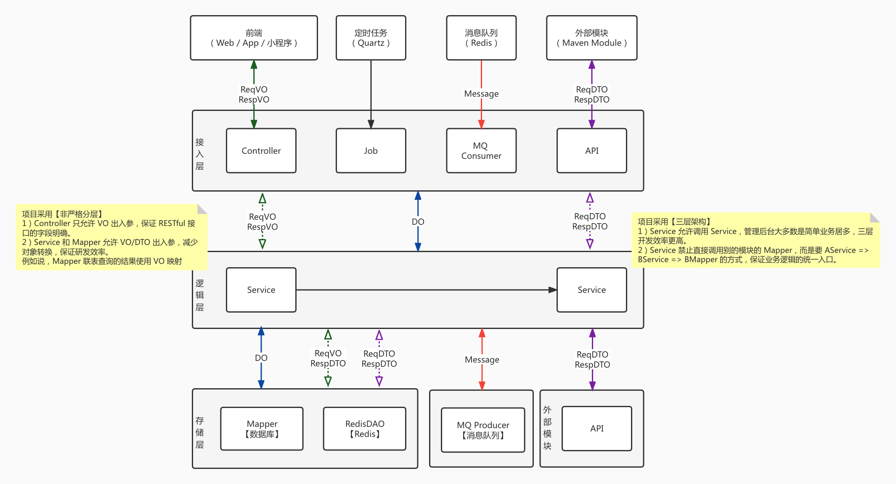

# 开源免费！开箱即用的智慧城市一网统管 AI 平台，开发者直接上手部署！

做智慧城市项目，还在为技术选型踩坑、架构从零搭建、多领域适配棘手而头疼？这里集成诺依框架、芋道源码、ThingsBoard 物联网平台、Flowable 流程引擎及 AI 大模型，下载代码即可免费搭建城市治理数字中枢，让开发效率直接翻倍！

覆盖城管住建（城市运行管理服务平台）、水利水务、生态环保、交通运输、应急安全、卫生健康、教育管理、文体旅游、产业园区、智慧社区、数字乡村、市场监管、综合执法、营商服务、停车管理、物业管理等政府治理全领域核心应用场景，以及电子商城、CRM、ERP等企业应用系统，提供完整部署脚本、开发规范与二次开发手册，Apache License 2.0 授权允许商业使用。无论你是做技术学习、项目快速落地还是二次定制开发，这款开源项目都能帮你少走一半的弯路！

后端采用 Spring MVC 6 + Spring Security 6，数据层使用 MySQL/Redis + Druid + MyBatis Plus + Dynamic Datasource；服务治理与消息/事务/任务由 Nacos、RocketMQ、Sentinel、Seata、XXL-Job承载；监控与可观测性采用 Spring Boot Admin + SkyWalking，接口文档与开发提效用 Springdoc + Jackson + MapStruct + Lombok；流程编排由 Flowable 工作流引擎提供 BPMN/BPMN2 执行与扩展能力。

前端采用 Vue 3 + Vite + Element Plus + TypeScript主流技术栈，基于组合式 API 与极速构建工具打造高效开发体验，集成 Pinia状态管理替代 Vuex、Vue Router实现路由控制。


## 一、平台简介

**智慧城市一网统管平台**是由福建亘川科技有限公司开发的城市治理核心系统，旨在通过 “一屏观全城、一网管全域” 实现城市运行的精细化、智能化管理。平台以 “横向到边、纵向到底、上下对应、内外衔接” 为设计原则，整合物联网、大数据、AI 大模型等技术，覆盖 17 大业务领域、16 大核心数据模块，构建 “监测 - 预警 - 决策 - 指挥 - 监督 - 服务 - 评价” 的全流程闭环，破解城市治理 “部门孤岛、数据割裂、响应滞后” 痛点。

### 核心价值

* **架构协同**：基于 KubeSphere 技术底座，实现 “业务 - 数据 - 支撑” 三维联动，打破碎片化治理；
* **业务弹性**：支持 17 + 领域场景增删，适配大中小城市本地化需求，预留扩展接口；
* **数据闭环**：AI 赋能数据全流程智能，替代 30%+ 人工操作，故障预判准确率 85%+；
* **安全高可用**：3 节点 Control 平面 + OpenEBS+Ceph 存储，兼顾稳定、安全与成本优化；
* **民生导向**：整合公众服务入口，诉求处置 3 工作日内反馈，评价驱动治理优化。

### 技术选型

* Java 后端：`master` JDK 17/21 + Spring Boot 3.2
* 后端采用 Spring Cloud Alibaba 微服务架构，注册中心 + 配置中心 Nacos，定时任务 XXL-Job，服务保障 Sentinel，服务网关 Gateway，分布式事务 Seata
* 数据库可使用 MySQL、Oracle、PostgreSQL、SQL Server、MariaDB、国产达梦 DM、TiDB 等，基于 MyBatis Plus、Redis + Redisson 操作
* 消息队列可使用 Event、Redis、RabbitMQ、Kafka、RocketMQ 等
* 权限认证使用 Spring Security & Token & Redis，支持多终端、多种用户的认证系统，支持 SSO 单点登录
* 支持加载动态权限菜单，按钮级别权限控制，Redis 缓存提升性能
* 支持 SaaS 多租户，可自定义每个租户的权限，提供透明化的多租户底层封装
* 工作流使用 Flowable，支持动态表单、在线设计流程、会签 / 或签、多种任务分配方式
* 高效率开发，使用代码生成器可以一键生成 Java、Vue 前后端代码、SQL 脚本、接口文档，支持单表、树表、主子表
* 实时通信，采用 Spring WebSocket 实现，内置 Token 身份校验，支持 WebSocket 集群
* 集成微信小程序、微信公众号、企业微信、钉钉等三方登陆，集成支付宝、微信等支付与退款
* 集成阿里云、腾讯云等短信渠道，集成 MinIO、阿里云、腾讯云、七牛云等云存储服务
* 集成报表设计器、大屏设计器，通过拖拽即可生成酷炫的报表与大屏

## 二、核心架构

平台采用五层架构设计，各层职责单一、单向依赖（上层依赖下层，下层不依赖上层），确保松耦合与高扩展性：


| 架构层级     | 核心职责                           | 关键模块 / 组件                                         |
|----------|--------------------------------|---------------------------------------------------|
| 1. 后台支撑层 | 提供技术底座，保障稳定运行、安全防护、数据衔接        | 系统管理（用户 / 角色 / 菜单）、数据汇聚、数据交换、集群监控、安全管理（WAF / 堡垒机） |
| 2. 数据中枢层 | 核心流程闭环，解决 “怎么管”，跨域通用           | 地理编码、网格管理、资产管理、设备管理、预警告警、指挥协调、综合评价、AI 赋能          |
| 3. 业务领域层 | 横向覆盖场景，解决 “管什么”，行业特化           | 城管住建、水利水务、生态环保、交通运输、应急安全、卫生健康等 17 大领域             |
| 4. 企业应用层 | 支撑国企运营，补充政企协同数据                | 商城系统、CRM 系统、ERP 系统                                |
| 5. 大屏总览层 | 可视化展示，适配指挥中心场景，支持 “总览 + 分域” 查看 | 城市全局总览、领域专属大屏（如城管住建大屏、水利水务大屏）                     |

### 平台架构图



### 技术架构图



## 三、功能模块详解

### 3.1 数据中枢（核心能力）

数据中枢是平台 “纵向到底” 的核心，提供跨领域通用能力，关键模块包括：

* **地理编码管理**：坐标系配置（2000 国家大地坐标系 / WGS84）、基本地点数据（区域 / 街巷 / 门楼牌 / POI）、编码规则配置；
* **网格管理**：行政区划配置（省 - 市 - 县 - 街道 - 社区）、网格划分（单元 / 管理 / 评价网格）、网格编码与数据管理；
* **资产管理**：资产分类 / 属性 / 关联规则配置、资产空间数据管理、资产状态统计；
* **设备管理**：基于 ThingsBoard CE 版，实现设备分类、遥测数据管理、实时状态监控、离线预警；
* **预警告警**：分域预警（按区域 / 网格 / 设备）、预警派单、处置跟踪、风险溯源；
* **指挥协调**：事件管理（接报 - 研判 - 分拨 - 处置）、应急预案、资源调度、跨域协同；
* **AI 赋能**：模型管理（接入豆包 / 通义千问等）、图像 / 视频识别、异常检测、趋势预测。

  #### 系统页面



#### 数据中枢



### 3.2 业务领域（横向覆盖）

覆盖 17 大核心领域，每个领域含 “监测 - 监管 - 处置 - 评价” 全流程功能，典型领域如下：


| 领域     | 核心功能                                             |
|--------|--------------------------------------------------|
| 城管住建   | 市政设施监测（道路 / 桥梁 / 燃气管网）、市容秩序监管、违建管理、建筑工地扬尘 / 噪声监测 |
| 水利水务   | 水资源监测、河湖水质 / 水位监测、供水漏损监测、排水防涝、农村饮水安全监测           |
| 生态环保   | 空气质量监测（PM2.5/PM10）、水环境质量、噪声污染、固废危废追踪             |
| 交通运输   | 交通设施监测、道路拥堵监测、公交 / 轨道交通运营、危险品运输监管                |
| 应急安全   | 重点区域监测、重大危险源监管、应急资源调度、灾害监测（气象 / 地质 / 洪涝）         |
| 卫生健康   | 健康服务管理、健康监测、应急响应、服务评价等                           |
| 教育管理   | 教育数据与指标管理、校园安全监测、不同阶段教育管理、服务与安全管理、疫情预警等          |
| 文体旅游   | 文旅资源与设施监测、运营管理、活动与服务质量监管、安全预警等                   |
| 产业园区   | 园区企业与安全监测、监管、应急管理、企业及公共服务等                       |
| 智慧社区   | 社区基础与人口管理、设施与安全监管、社区服务等                          |
| 数字乡村   | 乡村数据与设施监测、生产与环境管理、治理与民生服务、电商与文化建设、金融服务等          |
| 市场监管   | 企业相关监测与监管                                        |
| 综合执法   | 执法监测、执法监管、执法处置、执法评价等                             |
| 营商服务   | 营商环境监测、服务监管、问题处置、服务评价等                           |
| 停车管理   |                                                  |
| 物业管理   | 物业设施监测、物业管理监管、问题处置、服务评价等                         |
| 国有企业管理 | 商城系统、CRM系统、ERP系统等                                |

### 3.3 大屏总览（可视化）

大屏总览按 “全局 + 分域” 设计，统一二级导航为 “全局态势总览、分域场景专题、核心业务指标、事件预警追踪、应急指挥视图、跨域场景协同”，支持：

* **全局态势**：全域数据地图、核心指标（事件总数 / 处置率 / 预警数）、设施分布；
* **分域专题**：如城管住建的 “市政设施专题”“违建专题”，水利水务的 “防洪抗旱专题”；
* **应急指挥**：应急资源分布、指挥调度看板、事件处置进度跟踪。

#### 城管住建大屏



#### 水利水务大屏



#### 生态环保大屏



### 3.4 后台支撑（基础保障）

直接复用芋道源码核心能力，无需重复开发：

* **系统管理**：租户 / 用户 / 角色 / 权限管理、操作日志；
* **基础设施**：代码生成、数据源配置、定时任务；
* **数据汇聚**：城市基础数据 / 运行数据 / 管理数据的清洗融合；
* **安全管理**：权限审计、数据脱敏、网络安全（防火墙 / 入侵检测）。

## 四、技术栈选型

### 4.1 核心技术栈


| 类别     | 技术 / 组件            | 版本        | 用途说明                      |
|--------|--------------------|-----------|---------------------------|
| 容器平台   | KubeSphere         | v4.1.2    | 集群管理、应用部署、运维监控            |
| 物联网平台  | ThingsBoard CE     | 最新稳定版     | 设备接入、遥测数据管理、告警规则配置        |
| 开发框架   | 芋道源码（Ruoyi-Vue）    | 最新稳定版     | 后台管理、表单组件、权限控制            |
| 流程引擎   | Flowable           | 6.x       | 工单流程、审批流程（如预警派单、评价审核）     |
| 数据库    | MySQL/PostgresSQL  | 8.0+/14+  | 业务数据存储（按分层前缀命名）           |
| 存储     | OpenEBS+Ceph       | 最新稳定版     | 本地存储（OpenEBS）+ 共享存储（Ceph） |
| 前端可视化  | ECharts/Leaflet    | 5.x/1.9.x | 大屏图表、GIS 地图（区域 / 设施定位）    |
| AI 大模型 | 豆包 / 通义千问 / OpenAI | 最新 API 版  | 智能识别、决策辅助、客服问答            |

### 4.2 数据库设计规范

数据库表按 “六层结构” 设计，前缀区分层级，确保规范统一：

* 基础信息层（`sys_`）：全系统复用数据（如`sys_user`用户表、`sys_area`行政区划表）；
* 业务数据层（`biz_`）：核心业务数据（如`biz_asset`资产表、`biz_event`事件表）；
* 关联关系层（`rel_`）：解耦多对多关系（如`rel_asset_grid`资产 - 网格关联表）；
* 分析统计层（`stat_`）：预计算统计数据（如`stat_event_daily`事件日统计表）；
* 行业应用层（`gen_`）：行业特化数据（如`gen_gas_pipe_mon`燃气管网监测表）；
* 大屏总览层（`view_`）：可视化适配数据（如`view_overview`全局核心指标表）。

## 五、部署指南

### 5.1 环境准备

* **硬件要求**：
* Control 节点：3 台，16 核 CPU+16GB 内存 + 500GB 数据盘；
* Worker 节点：3 台（通用）+3 台（GPU，AI 场景），8 核 CPU+32GB 内存 + 500GB 数据盘；
* 存储节点：4 台，4 核 CPU+16GB 内存 + 3TB 数据盘（Ceph）；
* **软件要求**：
* 操作系统：openEuler 24.03 LTS SP1 x86\_64；
* 容器运行时：Containerd 1.7.13；
* 部署工具：KubeKey v3.1.7。

### 5.2 部署步骤

**快速搭建**

**一 需求与环境准备**

- 中间件与版本建议
  - **JDK 17 或 21（LTS）**
  - **Nacos 2.4.x**
  - **MySQL 8.0**
  - **Redis 6/7**
- 目标
  - 本地或服务器一键准备好中间件与 Java 运行环境
    -**JAR** 按依赖顺序启动：**yudao-gateway → yudao-module-system-server → yudao-module-bpm-server → gc-module-datacenter-server → gc-module-industry-server**
- 快速检查
  - 端口占用排查：**8848（Nacos）/ 3306（MySQL）/ 6379（Redis）/ 8080-9000（各服务）**
  - 建议将本机或服务器的 **hosts** 配置指向中间件（如 127.0.0.1 nacos mysql redis）

---

**二 中间件安装与初始化**

- 启动脚本（save as start-middlewares.sh，按需修改密码）

```
#!/usr/bin/env bash
set -eux

# 变量
MYSQL_ROOT_PW="Root@123456"
REDIS_PW="YourRedisPass"
DB_NAME="nacos"
NACOS_DIR="/opt/nacos"
REDIS_CONF="/etc/redis.conf"

# 关闭防火墙与 SELinux（快速启动场景）
systemctl stop firewalld && systemctl disable firewalld
sed -i 's/^SELINUX=.*/SELINUX=disabled/' /etc/selinux/config

# 关闭交换分区
swapoff -a
sed -i '/\sswap\s/s/^/#/' /etc/fstab

# 安装基础工具
dnf update -y
dnf install -y wget unzip vim net-tools lsof

# JDK 17
dnf install -y java-17-openjdk-devel
java -version

# MySQL 8.0
dnf install -y @mysql:8.0
systemctl enable --now mysqld
grep 'temporary password' /var/log/mysqld.log
mysql -uroot -p -e "
  CREATE DATABASE IF NOT EXISTS ${DB_NAME} CHARACTER SET utf8mb4 COLLATE utf8mb4_unicode_ci;
  ALTER USER 'root'@'localhost' IDENTIFIED WITH mysql_native_password BY '${MYSQL_ROOT_PW}';
  FLUSH PRIVILEGES;
"
echo "[mysql] OK"

# Redis 7
dnf install -y redis
cp ${REDIS_CONF} ${REDIS_CONF}.bak
cat > ${REDIS_CONF} <<EOF
bind 0.0.0.0
port 6379
appendonly yes
requirepass ${REDIS_PW}
daemonize no
pidfile /var/run/redis_6379.pid
EOF
systemctl enable --now redis
redis-cli -a ${REDIS_PW} ping && echo "Redis OK" || echo "Redis FAIL"

# Nacos 2.4.2
curl -O https://github.com/alibaba/nacos/releases/download/2.4.2/nacos-server-2.4.2.tar.gz
tar -xzf nacos-server-2.4.2.tar.gz -C /opt && ln -s /opt/nacos-server-2.4.2 /opt/nacos
mkdir -p /opt/nacos/logs

# 导入 Nacos 库（MySQL 已内置 schema，此处仅示例）
# mysql -uroot -p${MYSQL_ROOT_PW} ${DB_NAME} < /opt/nacos/conf/mysql-schema.sql

# 配置 Nacos 外置库（按需）
# sed -i "/^db.url.0=/c\db.url.0=jdbc:mysql://127.0.0.1:3306/${DB_NAME}?characterEncoding=utf8&useSSL=false&serverTimezone=Asia/Shanghai" /opt/nacos/conf/application.properties
# sed -i "/^db.user.0=/c\db.user.0=root" /opt/nacos/conf/application.properties
# sed -i "/^db.password.0=/c\db.password.0=${MYSQL_ROOT_PW}" /opt/nacos/conf/application.properties

# 启动 Nacos（单机）
/opt/nacos/bin/startup.sh -m standalone
tail -f /opt/nacos/logs/start.out

echo "All done. Access Nacos: http://127.0.0.1:8848/nacos (nacos/nacos)"
```

**三 平台服务启动**

- 下载并解压平台代码包
- 按依赖顺序启动 JAR 包

```bash
java -jar yudao-gateway.jar
java -jar yudao-module-system-server.jar
java -jar yudao-module-bpm-server.jar
java -jar gc-module-datacenter-server.jar
java -jar gc-module-industry-server.jar
```

### 5.3 参考文档

* 《系统部署架构设计文档》：`docs/deployment/系统部署架构``-20251018.md`
* 《ThingsBoard 配置指南》：`docs/guide/ThingsBoard_CE配置手册.md`
* 《芋道源码集成指南》：`docs/guide/芋道源码二次开发手册.md`

## 六、开发指南

### 6.1 开发规范

* **导航菜单设计**：扁平化三级结构，避免列表操作（增删改查）作为菜单，符合 “基础 - 常用 - 核心” 原则；
* **数据库表命名**：严格遵循六层前缀，英文名称蛇形命名（如`sys_user`），长度≤30 字符；
* **接口设计**：RESTful 风格，统一前缀`/api/v1/`，如`/api/v1/data-center/asset/list`；
* **前端开发**：基于 Vue3+Element Plus，复用芋道组件，大屏使用 ECharts+GIS 组件。

### 6.2 团队分工

参考附件《开发团队分工指南》，核心分工如下：

* **数据中枢组**：负责地理编码、网格管理、设备 / 资产管理模块开发；
* **行业应用组**：按领域分工（如城管住建组、水利水务组），开发行业特化功能；
* **大屏开发组**：负责全局 / 领域大屏的可视化设计与开发；
* **AI 集成组**：负责大模型接入（豆包 / 通义千问）、AI 识别功能开发；
* **运维组**：负责集群部署、监控告警、数据备份。

### 6.3 AI 大模型接入

支持接入多类 AI 模型，以 “豆包” 为例：

1. 在`sys_ai_model_registry`表注册模型信息；
2. 开发模型调用接口（`src/ai/model/client/DoubaoClient.java`）；
3. 集成到 AI 监测识别模块（如违章停车图像识别）；
4. 配置模型性能监控（`sys_ai_model_mon`表记录调用日志）。

## 七、项目目录结构

后端采用模块化的架构，按照功能拆分成多个 Maven Module，提升开发与研发的效率，带来更好的可维护性。

一共有**四**类 Maven Module：

| Maven Module         | 作用                 |
|----------------------|--------------------|
| `yudao-dependencies` | Maven 依赖版本管理       |
| `yudao-framework`    | Java 框架拓展          |
| gc-module-xxx`       | XXX 功能的 Module 模块  |
| `yudao-server`       | 管理后台 + 用户 App 的服务端 |

### 1. yudao-dependencies

该模块是一个 Maven Bom，只有一个 [`pom.xml` (opens new window)](https://github.com/YunaiV/yudao-cloud/blob/master/yudao-dependencies/pom.xml)文件，定义项目中所有 Maven 依赖的**版本号**，解决依赖冲突问题。

> 详细的解释，可见 [《微服务中使用 Maven BOM 来管理你的版本依赖 》 (opens new window)](http://www.iocoder.cn/maven/bom?yudao)文章。

从定位上来说，它和 Spring Boot 的 [`spring-boot-starter-parent` (opens new window)](https://mvnrepository.com/artifact/org.springframework.boot/spring-boot-starter-parent)和 Spring Cloud 的 [`spring-cloud-dependencies` (opens new window)](https://mvnrepository.com/artifact/org.springframework.cloud/spring-cloud-dependencies)是一致的。

虽然说，直接在根目录 [`pom.xml` (opens new window)](https://github.com/YunaiV/yudao-cloud/blob/master/pom.xml)管理依赖版本会更加方便，也符合绝大多数程序员的认知。但是要额外考虑一个场景，如果每个 `yudao-module-xxx` 模块都维护在一个独立的 Git 仓库，那么 `yudao-dependencies` 就可以在多个 `yudao-module-xxx` 模块下复用。

### 2. yudao-framework

该模块是 `yudao-cloud` 项目的框架封装，其下的每个 Maven Module 都是一个组件，分成两种类型：

① 技术组件：技术相关的组件封装，例如说 MyBatis、Redis 等等。

| Maven Module                               | 作用                                                    |
|--------------------------------------------|-------------------------------------------------------|
| `yudao-common`                             | 定义基础 pojo 类、枚举、工具类等                                   |
| `yudao-spring-boot-starter-web`            | Web 封装，提供全局异常、访问日志等                                   |
| `yudao-spring-boot-starter-websocket`      | WebSocket 封装，提供 Token 认证、WebSocket 集群广播、Message 监听    |
| `yudao-spring-boot-starter-security`       | 认证授权，基于 Spring Security 实现                            |
| `yudao-spring-boot-starter-mybatis`        | 数据库操作，基于 MyBatis Plus 实现                              |
| `yudao-spring-boot-starter-redis`          | 缓存操作，基于 Spring Data Redis + Redisson 实现               |
| `yudao-spring-boot-starter-mq`             | 消息队列，基于 Redis 实现，支持集群消费和广播消费                          |
| `yudao-spring-boot-starter-job`            | 定时任务，基于 Quartz 实现，支持集群模式                              |
| `yudao-spring-boot-starter-protection`     | 服务保障，提供幂等、分布式锁、限流、熔断等功能                               |
| `yudao-spring-boot-starter-excel`          | Excel 导入导出，基于 EasyExcel 实现                            |
| `yudao-spring-boot-starter-monitor`        | 服务监控，提供链路追踪、日志服务、指标收集等功能                              |
| `yudao-spring-boot-starter-test`           | 单元测试，基于 Junit + Mockito 实现                            |
| `yudao-spring-boot-starter-file` 【已合并】     | 文件客户端，支持将文件存储到 S3（MinIO、阿里云、腾讯云、七牛云）、本地、FTP、SFTP、数据库等 |
| `yudao-spring-boot-starter-captcha` 【已合并】  | 验证码 Captcha，提供滑块验证码                                   |
| `yudao-spring-boot-starter-flowable` 【已合并】 | 工作流，基于 Flowable 实现                                    |

友情提示：

- `yudao-spring-boot-starter-file` 组件：自 `2.0.1` 版本，合并到 `yudao-module-infra-server` 模块的 `framework/file` 包下，一方面减少 starter 提升编译速度，一方面只有 infra 模块使用到
- `yudao-spring-boot-starter-captcha` 组件：自 `2.0.1` 版本，合并到 `yudao-module-system-server` 模块的 `framework/captcha` 包下，一方面减少 starter 提升编译速度，一方面只有 system 模块使用到
- `yudao-spring-boot-starter-flowable` 组件：自 `2.0.1` 版本，合并到 `yudao-module-bpm-server` 模块的 `framework/flowable` 包下，一方面减少 starter 提升编译速度，一方面只有 bpm 模块使用到

② 业务组件：业务相关的组件封装，例如说数据字典、操作日志等等。如果是业务组件，名字会包含 `biz` 关键字。

| Maven Module                                     | 作用                    |
|--------------------------------------------------|-----------------------|
| `yudao-spring-boot-starter-biz-tenant`           | SaaS 多租户              |
| `yudao-spring-boot-starter-biz-data-permission`  | 数据权限                  |
| `yudao-spring-boot-starter-biz-operatelog` 【已合并】 | 操作日志                  |
| `yudao-spring-boot-starter-biz-pay` 【已合并】        | 支付客户端，对接微信支付、支付宝等支付平台 |
| `yudao-spring-boot-starter-biz-ip`               | 地区 & IP 库             |

友情提示：

- `yudao-spring-boot-starter-biz-operatelog` 组件：自 `2.1.0` 版本，合并到 `yudao-spring-boot-starter-security` 组件的 `operatelog` 包下，主要减少 starter 提升编译速度
- `yudao-spring-boot-starter-biz-pay` 组件：自 `2.5.1` 版本，合并到 `yudao-module-pay` 模块的 `framework/pay` 包下，因为只有它会使用到，更加聚焦收敛

每个组件，包含两部分：

1. `core` 包：组件的核心封装，拓展相关的功能。
2. `config` 包：组件的 Spring Boot 自动配置。

#### 3.1 整体结构

每个模块包含两个 Maven Module，分别是：

| Maven Module              | 作用                |
|---------------------------|-------------------|
| `yudao-module-xxx-api`    | 提供给其它模块的 API 定义   |
| `yudao-module-xxx-server` | 模块的功能的具体实现（服务提供者） |



总结来说，每个模块采用**三层**架构 + **非严格**分层，如下图所示：



#### 3.2 Controller 包

| 所在包                | 类                          | 作用                                                                                                                   | 示例                                   |
|--------------------|----------------------------|----------------------------------------------------------------------------------------------------------------------|--------------------------------------|
| `controller.admin` | Controller 类               | 提供给管理后台的 RESTful API，默认以`admin-api/` 作为前缀。 例如 `admin-api/system/auth/login` 登录接口                                     | AuthController                       |
| `controller.admin` | VO 类                       | Admin Controller 接口的入参 ReqVO、出参 RespVO                                                                               | AuthLoginReqVO、AuthLoginRespVO       |
| `controller.app`   | Controller 类，**以 App 为前缀** | 提供给用户 App 的 RESTful API，默认以`app-api/` 作为前缀。 例如 `app-api/member/auth/login` 登录接口                                      | AppAuthController                    |
| `controller.app`   | VO 类，**以 App 为前缀**         | App Controller 接口的入参 ReqVO、出参 RespVO                                                                                 | AppAuthLoginReqVO、AppAuthLoginRespVO |
| `controller`       | `.http` 文件                 | [IDEA Http Client 插件 (opens new window)](https://www.iocoder.cn/Spring-Boot/IDEA-HTTP-Client/?yudao)，模拟请求 RESTful 接口 | AuthController.http                  |

#### 3.3 Service 包

| 所在包       | 类             | 作用        | 示例                   |
|-----------|---------------|-----------|----------------------|
| `service` | Service 接口    | 业务逻辑的接口定义 | AdminUserService     |
| `service` | ServiceImpl 类 | 业务逻辑的实现类  | AdminUserServiceImpl |

#### 3.4 DAL 包

| 所在包              | 类          | 作用                             | 示例                        |
|------------------|------------|--------------------------------|---------------------------|
| `dal`            | -          | Data Access Layer，数据访问层        |                           |
| `dal.dataobject` | DO 类       | Data Object，映射数据库表、或者 Redis 对象 | AdminUserDO               |
| `dal.mysql`      | Mapper 接口  | 数据库的操作                         | AdminUserMapper           |
| `dal.redis`      | RedisDAO 类 | Redis 的操作                      | OAuth2AccessTokenRedisDAO |

#### 3.5 API 包

| 所在包   | 类         | 作用                          | 示例                                    |
|-------|-----------|-----------------------------|---------------------------------------|
| `api` | Api 接口    | 提供给其它模块的 API 接口             | AdminUserApi                          |
| `api` | ApiImpl 类 | 提供给其它模块的 API 实现类            | AdminUserApiImpl                      |
| `api` | DTO 类     | Api 接口的入参 ReqDTO、出参 RespDTO | AdminUserRespDTO、SocialUserBindReqDTO |

#### 3.6 MQ 包

| 所在包           | 类          | 作用                 | 示例              |
|---------------|------------|--------------------|-----------------|
| `mq`          | -          | Message Queue，消息队列 |                 |
| `mq.message`  | Message 类  | 发送和消费的消息           | SmsSendMessage  |
| `mq.producer` | Producer 类 | 消息的生产者             | SmsProducer     |
| `mq.consumer` | Consumer 类 | 消息的消费者             | SmsSendConsumer |

#### 3.7 Job 包


| 所在包   | 类     | 作用   | 示例      |
|-------|-------|------|---------|
| `job` | Job 类 | 定时任务 | DemoJob |

#### 3.8 Enum 包


| 所在包     | 类                    | 作用      | 示例                 |
|---------|----------------------|---------|--------------------|
| `enums` | Enum 类               | 字段的枚举   | SocialTypeEnum     |
| `enums` | DictTypeConstants 类  | 数据字典的枚举 | DictTypeConstants  |
| `enums` | ErrorCodeConstants 类 | 错误码的枚举  | ErrorCodeConstants |

#### 3.9 其它


| 所在包         | 类          | 作用                      | 示例                        |
|-------------|------------|-------------------------|---------------------------|
| `convert`   | Convert 接口 | DTO / VO / DO 等对象之间的转换器 | UserConvert               |
| `framework` | -          | 模块自身的框架封装               | YudaoCaptchaConfiguration |

## 👾 前端结构

```
.
├── .github # github workflows 相关
├── .husky # husky 配置
├── .vscode # vscode 配置
├── mock # 自定义 mock 数据及配置
├── public # 静态资源
├── src # 项目代码
│   ├── api # api接口管理
│   ├── assets # 静态资源
│   ├── components # 公用组件
│   ├── hooks # 常用hooks
│   ├── layout # 布局组件
│   ├── locales # 语言文件
│   ├── plugins # 外部插件
│   ├── router # 路由配置
│   ├── store # 状态管理
│   ├── styles # 全局样式
│   ├── utils # 全局工具类
│   ├── views # 路由页面
│   ├── App.vue # 入口vue文件
│   ├── main.ts # 主入口文件
│   └── permission.ts # 路由拦截
├── types # 全局类型
├── .env.base # 本地开发环境 环境变量配置
├── .env.dev # 打包到开发环境 环境变量配置
├── .env.gitee # 针对 gitee 的环境变量 可忽略
├── .env.pro # 打包到生产环境 环境变量配置
├── .env.test # 打包到测试环境 环境变量配置
├── .eslintignore # eslint 跳过检测配置
├── .eslintrc.js # eslint 配置
├── .gitignore # git 跳过配置
├── .prettierignore # prettier 跳过检测配置
├── .stylelintignore # stylelint 跳过检测配置
├── .versionrc 自动生成版本号及更新记录配置
├── CHANGELOG.md # 更新记录
├── commitlint.config.js # git commit 提交规范配置
├── index.html # 入口页面
├── package.json
├── .postcssrc.js # postcss 配置
├── prettier.config.js # prettier 配置
├── README.md # 英文 README
├── README.zh-CN.md # 中文 README
├── stylelint.config.js # stylelint 配置
├── tsconfig.json # typescript 配置
├── vite.config.ts # vite 配置
└── windi.config.ts # windicss 配置
```

## 八、贡献说明

1. **分支管理**：

* `main`：稳定版本分支，仅合并 release 分支；
* `develop`：开发分支，日常开发提交；
* `feature/xxx`：功能分支（如`feature/urban-noise-mon`）；

1. **提交规范**：

* 格式：`type(scope): description`，如`feat(water): 新增河湖水质监测功能`；
* 类型：`feat`（新功能）、`fix`（修复）、`docs`（文档）、`refactor`（重构）；

1. **PR 流程**：

* 从`feature`分支提交 PR 到`develop`；
* 需 2 名开发人员 Code Review 通过；
* 自动化测试（单元测试 + 接口测试）通过后合并。

## 九、许可证

本项目开源版本采用**Apache License 2.0**，允许商业使用，但需保留版权声明。

## 十、联系我们

### 亘川智城官网

**点击跳转**：http://genchuan.cn

### 企业微信客服
扫描下方二维码，联系我们，获取技术支持与服务。


### 亘川智城SaaS平台

地址：http://cloud.genchuan.cn 
账号密码：请联系我们获取吧

### 公众号
亘川科技


